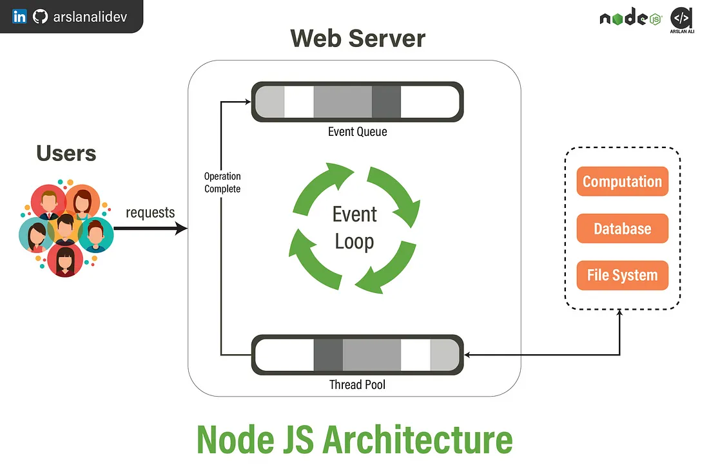

# What is Node JS ?

-  Node JS is a `single-treaded`, `non-blocking`, `asynchronous` javascript:
   runtime environment.
-  Node JS helps us to run javascript on server side.

## If Node Js `single-treaded` , how it's works `non-blocking` way?

-  Follow the below photo:
   ;
-  when a user request on server,
-  Then `node js` have an `Event Loop` with `Event Queue` and `Thread Pool`.
-  Every `synchronous` tasks excuted on `event queue`
-  If `Event loop` find any `asynchronous request` (like `Computation`,
   `Database operation`, `File System`) , `Event Loop send ` the request to
   `Thread Pool`
-  After completing the operation `Thread pool` send again the event to
   `event loop`.

## Asynchronous Data handles:

-  ### By using call back :

   -  By using `callback function` we can handle `asynchronous` tasks.

   ```js
   setTimeout(() => {
      console.log("ami mostafiz async".yellow);
   }, 2000);
   ```

   -  It's causes `callback hells` when we call nested callback.
   -  Example :

   ```js
   setTimeout(() => {
      const user = true;
      if (user) {
         //  load user products by depending on user id :
         setTimeout(() => {
            const products = [
               { id: 1, name: "tshirt" },
               { id: 2, name: "shirt" },
            ];
            console.log(products);
            if (products) {
               setTimeout(() => {
                  const prices = [100, 200, 300];
                  console.log(prices);
               }, 200);
            }
         }, 500);
      }
   }, 1000);
   ```

   -  multiple nested `callback function` helds `callback hell`

-  ### Promise In JavaScript :

   -  Promise have three state like `pending`, `resolve`, `reject`
   -  To define a Promise define use `Promise()` constructor with `new` keyword.
   -  Promise get a callback function as parameter, which have two parameter
      like `resolve` and `reject`
   -  If Promise Successfully Completed it's call the `resolve()`, otherwise
      call `reject()`
   -  Example:

   ```js
   //  Promise Making or Define:

   const myPromise = new Promise((resolve, reject) => {
      const user = true;
      if (!user) {
         reject({ result: "now found", success: false });
      } else {
         setTimeout(() => {
            resolve({
               result: "Promise send data successfully",
               success: true,
            });
         }, 1000);
      }
   });

   //  Promise Consuming :

   myPromise.then((res) => console.log(res)).catch((err) => console.log(err));
   ```

   -  To consume the `Promise` use `then`, `catch`, `finally`

   ### Multiple `Promise handle`:

   ```js
   const myPromise = new Promise((resolve, reject) => {
      const user = true;
      if (!user) {
         reject({ result: "now found", success: false });
      } else {
         setTimeout(() => {
            resolve({ id: 1, name: "jhone" });
         }, 1000);
      }
   });

   //  Promise Consuming :

   // myPromise.then((res) => console.log(res)).catch((err) => console.log(err));

   const userIds = [1, 2, 3, 4, 5, 6];
   let userData = [];

   for (let i = 0; i < userIds.length; i++) {
      userData.push(myPromise);
   }

   Promise.all(userData)
      .then((res) => console.log(res))
      .catch((err) => console.log(err));

   console.log("userData after promise", userData);
   ```

-  ###` async/await` Asychconous function handler:

   -  we can consume any promise by using `async/await`
   -  Example:
   -  ```js
      const friendPromise = new Promise((resolve, reject) => {
         const gifts = { id: "4", gift: "headphone" };
         if (gifts.id) {
            setTimeout(() => {
               resolve(gifts);
            }, 5000);
         } else {
            reject({ result: "is't success" });
         }
      });

      const friends = [1, 2, 3];
      const myGiftPromise = [];
      for (let i of friends) {
         myGiftPromise.push(friendPromise);
      }

      const getData = async () => {
         const res = await Promise.all(myGiftPromise);
         console.log(res);
      };

      getData();
      ```

      -  Another Example:

      -  ```js
            const getPosts = async () => {
               const res = await fetch(
                  `https://jsonplaceholder.typicode.com/posts`
               );
               const data = await res.json();
               console.log(data);
            };

            getPosts();
         ```
