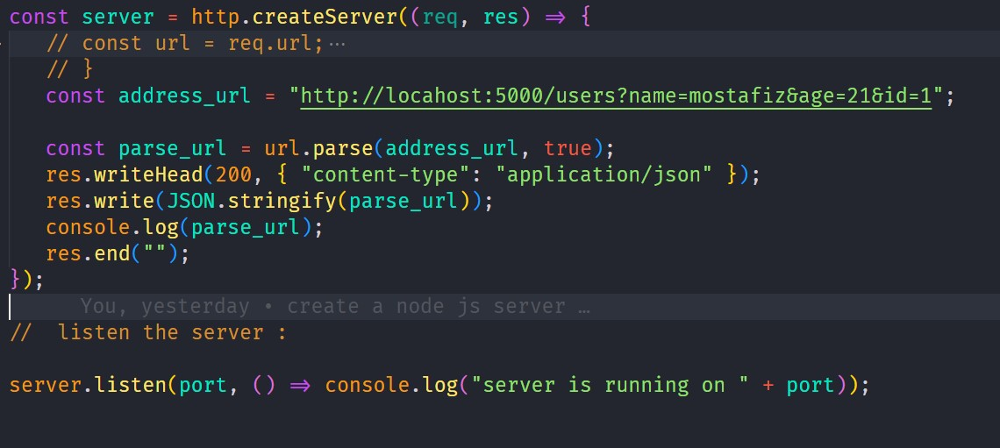

# Node Js Modules

-  Node Js have 3 Types of modules like `core modules`, `local modules`,
   `third party modules`
-  `Core Modules`: Node Js have some own modules like :
-  | Module      | work                                                                                     |
   | ----------- | ---------------------------------------------------------------------------------------- |
   | http        | http modules includes `classes`, `methods` and `events` to create node js `http` server. |
   | url         | url modules includes `methods` for url `resulation` and `parsing`                        |
   | querystring | query string modules includes methods to deal query string                               |
   | path        | path modules includes method to deal `file path`                                         |
   | fs          | includes method classes and events to work with file I/O                                 |
   | util        | util module includes utility functions useful for programmers.                           |
-  `Local Module`: The module which we create and export or import.
-  `Third Party Module`: Third party modules are third party packages that we
   install to complete any specific task.

# Create a Simple http server :

-  require `http` from 'http'
-  http contains an function `createServer`.
-  `createServer` server receive a function as `parameter`.
-  Create server has two parameter like `(req, res)`
-  Then listen the server on a port.
-  Example:
-  ```js
   const http = require("http");
   const port = 5000;
   const http = require("http");
   const port = 5000;

   const server = http.createServer((req, res) => {
      res.end("server is running ");
   });

   server.listen(port, () => {
      console.log("server is running now port : 5000");
   });
   ```

# Request Response Model In Node JS :

-  when a user request to node js server `server sends` response with `html` or
   `data`
-  Example Image: 
-  Response have two part `Status Code ` and `Data`
-  Data have two part `Head` and `Body`.
-  `Head` contains sensitive data like `content-type: "application/json"`,
   `content-length: 500` etc.
-  `Body` contains `response data`
-  Example image; ;

# Request Object in node js :

| Properties | description                                      | example                |
| ---------- | ------------------------------------------------ | ---------------------- |
| `req.url`  | `req.url` gives us the `pathname` after baseURL. | `console.log(req.url)` |

# Response Object in node js :

| Properties        | description                                                                                                                                                         | example                                                                                          |
| ----------------- | ------------------------------------------------------------------------------------------------------------------------------------------------------------------- | ------------------------------------------------------------------------------------------------ |
| `res.writeHead()` | `res.writeHead()` function have two parameter `statusCode` & `content-type`. `content-type` value will be `text/html` or `application/json`                         | `res.writeHead(200, {"Content-Type:"application/json"})`                                         |
| `res.write()`     | `req.write()` helps to write response. `req.write()` return an `string`. If you want to send `object` or `array` . need to convert `string` with `JSON.stringify()` | `res.write("<p>Home Page.</p>");` <br/> `res.write(JSON.stringify({id: 1, name: 'javascript'}))` |
| `res.end()`       | `req.end()` end the response.` After every request, we need to end the response. Otherwise the serer will be stack.                                                 | `res.end()`                                                                                      |

# `url` module in node js :

-  require `url` from `url` :
   ```js
   const url = require("url");
   ```
-  `url` object conatains some `function` and properties:

   ```js

   // prototype of url object :
      {
         Url: [Function: Url],
         parse: [Function: urlParse],
         resolve: [Function: urlResolve],
         resolveObject: [Function: urlResolveObject],
         format: [Function: urlFormat],
         URL: [class URL] {
            canParse: [Function: canParse],
            createObjectURL: [Function: createObjectURL],
            revokeObjectURL: [Function: revokeObjectURL]
         },
         URLSearchParams: [class URLSearchParams],
         domainToASCII: [Function: domainToASCII],
         domainToUnicode: [Function: domainToUnicode],
         pathToFileURL: [Function: pathToFileURL],
         fileURLToPath: [Function: fileURLToPath],
         urlToHttpOptions: [Function: urlToHttpOptions]
      }
   ```

-  Url properties Details :
-  | Properties    | task                                                                                                                        | Example                               |
   | ------------- | --------------------------------------------------------------------------------------------------------------------------- | ------------------------------------- |
   | `url.parse()` | - `url.parse()` has two parameter. - 1st parameter is `url string` -2nd parameter is `boolean` value for `parseQueryString` |  |

### `url.parse(url:string, parseQueryString: boolean)` return an object like below:

```js
 {
         protocol: 'http:',
         slashes: true,
         auth: null,
         host: 'locahost:5000',
         port: '5000',
         hostname: 'locahost',
         hash: null,
         search: '?name=mostafiz&age=21&id=1',
         query: [Object: null prototype] { name: 'mostafiz', age: '21', id: '1' },
         pathname: '/users',
         path: '/users?name=mostafiz&age=21&id=1',
         href: 'http://locahost:5000/users?name=mostafiz&age=21&id=1'
      }
```

## `fs` modules in Node JS:

-  to complete file operation in node js , we can use fs modules:
-  Fs modules have some functions to read, write, delete and update file. They
   should work `asynchronously` or `synchronously`.
-  Fs function are :
-  | Asynchronous function                              | Synchronous Func                            | work                            |
   | -------------------------------------------------- | ------------------------------------------- | ------------------------------- |
   | `fs.readFile(fileName, [options], callback)`       | `fs.readFileSync(fileName, [options])`      | to read files                   |
   | `fs.writeFile(fileName,data, [options], callback)` | `fs.readFileSync(fileName,data, [options])` | to write files                  |
   | `fs.rename(oldPathName, newPathName, callback)`    | `fs.readFileSync(oldPathName,newPathName)`  | to rename any files name        |
   | `fs.exits(path, callback)`                         | `fs.exitsSync(path)`                        | to cheacking file exit or not ? |
   | `fs.appendFile(file,data, [options], callback)`    | `fs.appendFile(file, data, [options])`      | append data on file             |

   ### `fs.ReadFile(path, [options], callbackFunc )` :

   -  The `fs.readFile()` method is an inbuilt method which is used to read the
      file.
   -  `fs.ReadFile()` has three parameter : `path`, `[options]`, `callback`
   -  `path` -> `path` must be buffer or string;
   -  `[options]` -> `[options]` are optional
   -  `callbackfunction` called after reading file. it takes two parameter:

      -  `err`: if any `err` occurs.
      -  `data`: data contains the buffer of contents of the file.

   -  ```js
      fs.readFile("data.txt", (err, data) => {
         if (err) {
            res.writeHead(403, { "content-type": "text/html" });
            res.write("Data not found");
            res.end();
         } else {
            const text = data;
            //  convert buffer to string with toString():
            const plaintext = data.toString();
            console.log(plaintext);
            //  convert plain text to arrary :
            const textArr = plaintext.split(". ");
            const tagArray = textArr.map(
               (i) =>
                  `<p class="font-size: 10px; color: red; background: black; ">${i}</p>`
            );

            let normaltext = " ";
            for (let i of tagArray) {
               normaltext = normaltext + ` <br />` + i;
            }

            res.writeHead(200, { "content-type": "text/html" });
            res.write(normaltext);
            res.end();
         }
      });
      ```

   ### `fs.ReadFileSync(path, [options])`: it's returns data;

   -  `fs.readFileSync()` method, we can read files in a synchronous way.
   -  `fs.readFileSync()` method has two parameter : `path` & `[options]`
   -  `path` : path will string or buffer. like : `./data.text`.
   -  `[options]`: `[options]` is optional.
   -  it's return the data that read text from file.

   ```js
   const server = http.createServer((req, res) => {
      const data = fs.readFileSync("data.txt");
      console.log(data.toString());
      res.writeHead(200, { "content-type": "text/html" });
      res.write(data.toString());
      res.end();
   });
   ```

   ### `fs.writeFile(file, data, [options], callback )` :

   -  The function have four parameter: `file`, `data`, `[options]`, `callback`.
   -  `file`: The is a string, Buffer, URL or file description.
   -  `data`: data will be string , buffer or typed array.
   -  [options]: its an optional object.
   -  `callbackfunc`: callback function has an `err` parameter. if any ocur
      found err will be held.

   ```js
   fs.writeFile("./data.txt", "Mostafizur Rahaman Fahim.", (err) => {
      if (!err) {
         res.writeHead(200, { "content-type": "text/html" });
         res.write("Data is edited now");
         res.end();
      } else {
         res.writeHead(401, { "content-type": "text/html" });
         res.write(`Data not found`);
         res.end();
      }
   });
   ```

### `fs.writeFileSync(file, data, [options])`:

```js
fs.writeFileSync("data.txt", "i am mostafizur rahaman ");
console.log("file updated");
```

### `fs.rename(oldpath, newpath, callback)`:

```js
fs.rename("data.txt", "datafile.txt", () => {
   console.log("file renamed successfully.");
   res.writeHead(200, { "content-type": "text/html" });
   res.write("file renamed successfully");
   res.end();
});
```

### `fs.renameSync(oldpath, newPath)`;

```js
fs.renameSync("datafile.txt", "mydata.txt");
console.log("file rename succedded");
```

### `fs.exits(path, callback)`:

-  `fs.exits()` has to two parameter like: `path`, `callback`;
-  `path`: `path` will be string or buffer.
-  `callbackfunc` : `callbackfunc` has an `exits` parameter, that value is
   boolean.

```js
fs.renameSync("datafile.txt", "mydata.txt");
console.log("file rename succedded");
```

### `fs.exitsSync(path)`

-  `fs.exitsSync()` has a parameter `path`. That will be string or buffer.
-  `fs.exitsSync()` returns a `boolean` value `true` or `false`.

```js
const fileExits = fs.existsSync("data.txt");
if (fileExits) {
   console.log("mostafiz");
} else {
   console.log("fahim");
}
```

### `fs.appendFile(path, data, [option], callback)`:

-  `appendFile()` helps to append data into an exiting file.
-  If file not exits create a new file.
-  the callback have an parameter `err`.
-  you can cheak any error when appending data.

```js
fs.appendFile(
   "./mydata.txt",
   "Lorem ipsum dolor sit amet consectetur.",
   (err) => {
      if (err) {
         console.log(err);
      } else {
         console.log("data successfully appended");
      }
   }
);
```

### `fs.appendFileSync(path, data, [options])`:

-  `appendFileSync()` has three parameter.
-  path should be string or buffer.
-  data should be string or buffer.
-  it's not return any thing.
-  if it executed, go the next line syncrhonously.

```js
fs.appendFileSync("mydata.txt", "ami ami ami");
console.log("Oh all fs moudle function learnt");
```
